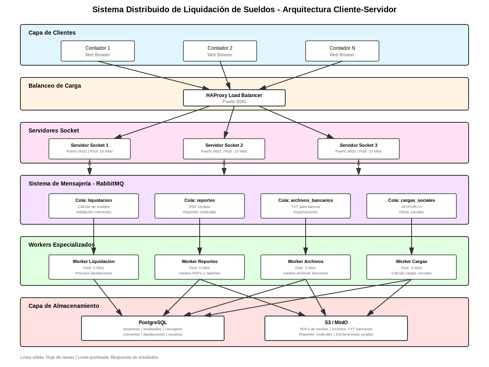

# Sistema Distribuido de Liquidación de Sueldos

Sistema distribuido cliente-servidor para procesamiento de liquidaciones de sueldos en estudios contables. Implementa una arquitectura escalable con balanceo de carga, colas de mensajes y workers especializados.

## Arquitectura

El sistema implementa una arquitectura distribuida con los siguientes componentes:

- **Clientes Python**: Se conectan directamente por socket TCP
- **Clientes Web/Móviles**: Acceden vía API REST (Flask)
- **API REST (Gateway)**: Convierte peticiones HTTP a socket TCP
- **Servidores Socket**: Reciben tareas y las publican en RabbitMQ
- **RabbitMQ**: Sistema de colas de mensajes para desacoplar componentes
- **Workers Especializados**: Procesan tareas específicas en paralelo
- **PostgreSQL**: Base de datos para almacenamiento de datos
- **S3/MinIO**: Almacenamiento de archivos generados

### Diagrama de Arquitectura



## Componentes

### API REST (Gateway HTTP)

Servidor Flask que actúa como puerta de entrada para clientes web y móviles:

- Puerto 5000
- Recibe peticiones HTTP/JSON
- Se conecta internamente a servidores socket
- Endpoints RESTful para todas las operaciones

### Servidores Socket

Tres servidores que escuchan conexiones TCP y publican tareas en RabbitMQ:

- Servidor 1: Puerto 9001
- Servidor 2: Puerto 9002
- Servidor 3: Puerto 9003

Cada servidor maneja múltiples conexiones simultáneas mediante pool de hilos.

### Workers

Cuatro tipos de workers especializados:

**Worker Liquidación** (Pool: 5 hilos)
- Cálculo de sueldos brutos y netos
- Validación de conceptos por convenio
- Cálculo de deducciones y cargas sociales

**Worker Reportes** (Pool: 5 hilos)
- Generación de recibos de sueldo en PDF
- Reportes sindicales
- Papeles de trabajo

**Worker Archivos Bancarios** (Pool: 3 hilos)
- Generación de archivos TXT para bancos
- Formato posicional estándar argentino
- Validación de CBU

**Worker Cargas Sociales** (Pool: 3 hilos)
- Declaraciones juradas AFIP/ARCA
- Liquidaciones para obras sociales
- Cálculo de aportes patronales

### Colas de RabbitMQ

- `liquidacion`: Tareas de cálculo de sueldos
- `reportes`: Generación de documentos
- `archivos_bancarios`: Archivos de pago
- `cargas_sociales`: Declaraciones juradas

## Requisitos

- Python 3.8+
- Docker y Docker Compose
- Git

## Instalación

### 1. Clonar el repositorio

```bash
git clone https://github.com/tu-usuario/liquidacion-sueldos-distribuido.git
cd liquidacion-sueldos-distribuido
```

### 2. Crear entorno virtual

```bash
python -m venv .venv
```

### 3. Activar entorno virtual

Linux/Mac:
```bash
source .venv/bin/activate
```

Windows:
```bash
.venv\Scripts\activate
```

### 4. Instalar dependencias

```bash
pip install -r requirements.txt
```

Esto instalará:
- pika (RabbitMQ)
- psycopg2-binary (PostgreSQL)
- python-dotenv (variables de entorno)
- flask (API REST)
- flask-cors (CORS para frontend)

### 5. Configurar variables de entorno

```bash
cp .env.example .env
```

Editar `.env` si necesitas cambiar alguna configuración.

### 6. Levantar infraestructura

```bash
docker-compose up -d
```

Esto iniciará RabbitMQ y PostgreSQL. Verificar que estén corriendo:

```bash
docker-compose ps
```

### 7. Verificar servicios

- RabbitMQ Management: http://localhost:15672 (admin/admin123)
- PostgreSQL: localhost:5432 (postgres/postgres123)

### 8. Insertar datos de prueba

IMPORTANTE: Antes de usar el sistema, debes insertar datos de prueba en la base de datos.

```bash
python scripts/insert_data.py
```

Este script crea:
- 1 empresa de prueba (Empresa Test SA)
- 5 empleados de prueba
- Datos necesarios para ejecutar el sistema

## Uso

### Iniciar Servidores Socket

Terminal 1:
```bash
python src/servidor/socket_server.py 9001
```

Terminal 2:
```bash
python src/servidor/socket_server.py 9002
```

Terminal 3:
```bash
python src/servidor/socket_server.py 9003
```

### Iniciar Workers

Terminal 4:
```bash
python src/workers/worker_liquidacion.py
```

Terminal 5:
```bash
python src/workers/worker_reportes.py
```

Terminal 6:
```bash
python src/workers/worker_archivos.py
```

Terminal 7:
```bash
python src/workers/worker_cargas.py
```

### Enviar Tareas (Cliente)

Terminal 8:
```bash
python src/cliente/cliente.py
```

Seleccionar el tipo de tarea a enviar desde el menú interactivo.

## Acceso Web/Mobile (API REST)

El sistema incluye una API REST que permite el acceso desde clientes web y móviles.

### Iniciar API REST

Terminal 8:
```bash
python src/api/rest_api.py
```

La API estará disponible en: http://localhost:5000

### Acceder al Dashboard Web

1. Asegurar que la API REST esté corriendo
2. Abrir en el navegador:
```
frontend/index.html
```

El dashboard web permite:
- Enviar liquidaciones de sueldos
- Generar reportes
- Crear archivos bancarios
- Calcular cargas sociales
- Ver resultados en tiempo real

### Endpoints de la API

- `GET /health` - Estado de la API
- `POST /api/liquidacion` - Enviar liquidación
- `POST /api/reporte` - Generar reporte
- `POST /api/archivo-bancario` - Generar archivo bancario
- `POST /api/cargas-sociales` - Calcular cargas sociales
- `POST /api/tarea` - Endpoint genérico

## Ejemplos de Uso

### Liquidación de Sueldo

```python
from cliente.cliente import Cliente

cliente = Cliente()

tarea = {
    'tipo': 'liquidacion',
    'empresa_id': 1,
    'empleado_id': 1,
    'periodo': '2025-10',
    'procesado_por': 'Juan Perez',
    'conceptos': [
        {'codigo': '00001', 'nombre': 'Sueldo Basico', 'tipo': 'remunerativo', 'monto': 500000},
        {'codigo': '000100', 'nombre': 'Antiguedad', 'tipo': 'remunerativo', 'monto': 50000}
    ]
}

respuesta = cliente.enviar_tarea(tarea)
```

### Generar Archivo Bancario

```python
tarea = {
    'tipo': 'archivo_bancario',
    'empresa_id': 1,
    'periodo': '2025-10',
    'banco': 'nacion'
}

respuesta = cliente.enviar_tarea(tarea)
```

### Calcular Cargas Sociales

```python
tarea = {
    'tipo': 'carga_social',
    'tipo_carga': 'afip',
    'empresa_id': 1,
    'periodo': '2025-10'
}

respuesta = cliente.enviar_tarea(tarea)
```

## Estructura del Proyecto

```
liquidacion-sueldos-distribuido/
├── diagrams/                   # Diagramas de arquitectura
├── frontend/                   # Dashboard web
│   ├── index.html             # Interfaz web
│   └── styles.css             # Estilos CSS
├── scripts/                    # Scripts de utilidad
│   └── insert_data.py         # Inserción de datos de prueba
├── src/
│   ├── api/                   # API REST (Flask)
│   │   └── rest_api.py       # Servidor HTTP gateway
│   ├── cliente/               # Cliente socket
│   ├── servidor/              # Servidores socket
│   ├── workers/               # Workers especializados
│   ├── common/                # Código compartido
│   └── config/                # Configuración
├── tests/                     # Tests de integración
├── docker-compose.yml         # Infraestructura
├── init.sql                   # Schema de base de datos
├── requirements.txt           # Dependencias Python
└── README.md                  # Este archivo
```

## Base de Datos

### Tablas Principales

- `empresas`: Empresas clientes del estudio
- `convenios`: Convenios colectivos de trabajo
- `conceptos`: Códigos de liquidación
- `empleados`: Empleados de las empresas
- `liquidaciones`: Registro de liquidaciones procesadas
- `tareas`: Log de tareas procesadas

### Datos Precargados

- 3 convenios colectivos (Comercio, Metalúrgico, Construcción)
- 9 conceptos básicos de liquidación

## Tecnologías

- **Python 3.8+**: Lenguaje principal
- **Socket**: Comunicación cliente-servidor
- **Threading**: Procesamiento concurrente
- **RabbitMQ**: Cola de mensajes
- **PostgreSQL**: Base de datos relacional
- **Docker**: Containerización de servicios
- **pika**: Cliente Python para RabbitMQ
- **psycopg2**: Cliente Python para PostgreSQL

## Características

- Arquitectura distribuida y escalable
- Procesamiento concurrente con pools de hilos
- Desacoplamiento mediante colas de mensajes
- Persistencia de datos en PostgreSQL
- Simulación de almacenamiento S3
- Manejo de errores y reintentos
- Tests de integración automatizados

## Verificación del Sistema

### Ejecutar Tests de Integración

Una vez que el sistema esté funcionando (servidor y workers corriendo), ejecutar:

```bash
python tests/test_integration.py
```

Este script ejecuta automáticamente:
- Test de liquidación de sueldo
- Test de generación de reporte
- Test de archivo bancario
- Test de cargas sociales
- Test de carga concurrente
- Verificación de resultados en base de datos

Resultado esperado: 6/6 tests exitosos

## Trabajo Práctico

Este proyecto fue desarrollado como parte del Trabajo Práctico Final de la materia DevOps y Redes.

**Consignas cumplidas:**

1. Diagrama de arquitectura con todos los componentes solicitados
2. Implementación de servidor socket que distribuye tareas a workers
3. Implementación de cliente que envía tareas y recibe resultados
4. Uso de RabbitMQ para comunicación entre componentes
5. Almacenamiento distribuido (PostgreSQL + S3 simulado)
6. Pool de hilos en servidores y workers
7. Código documentado y funcional

## Autor
Contadora Publica Nacional Ayelen Rojas 
Desarrollado para el TP3 de la Tecnicatura en Desarrollo de Software.

## Licencia

Este proyecto es de uso académico.